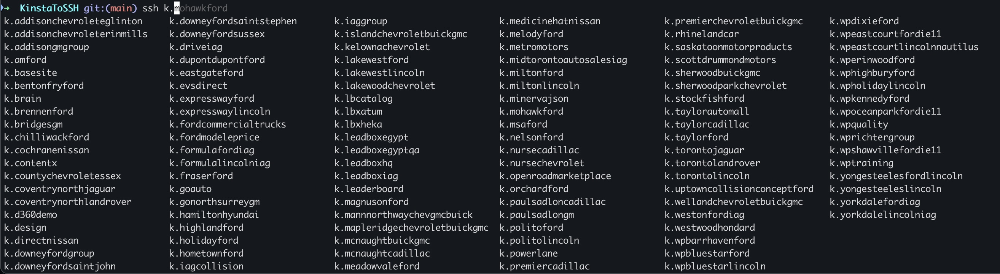

# Kinsta WP Site to SSH Config

Generates SSH config aliases for all your Kinsta WordPress sites, so you can connect with simple commands like `ssh k.sitename`.

## Usage Example



## Prerequisites

- Python 3.x
- pip (Python package manager)
- A Kinsta account with API access
- Your SSH public key added to Kinsta (User Settings > SSH Keys)

## Setup

1. Clone this repository:
   ```bash
   git clone https://github.com/leadbox-ryan/kinsta-to-ssh.git
   cd kinsta-to-ssh
   ```

2. Install Python requirements:
   ```bash
   pip install -r requirements.txt
   ```

3. Create a `.env` file in the project root with your Kinsta credentials:
   ```
   KINSTA_API_KEY=your_api_key_here
   KINSTA_COMPANY_ID=your_company_id_here
   ```

   To get these values:
   - **KINSTA_API_KEY**:
     1. Log in to your Kinsta account
     2. Go to User Settings > API Keys
     3. Create a new API key or use an existing one

   - **KINSTA_COMPANY_ID**:
     1. Log in to your Kinsta account
     2. The company ID is visible in the URL when you're on the dashboard
     3. It's the number after `/company/` in the URL

4. Make the script executable (Mac/Linux):
   ```bash
   chmod +x kinsta_ssh_config.py
   ```

5. Run the script:
   ```bash
   ./kinsta_ssh_config.py
   # Or on Windows:
   python kinsta_ssh_config.py
   ```

6. Include the generated config in your main SSH config.
   Add this line to your `~/.ssh/config` file:
   ```
   Include ~/.ssh/kinsta.config
   ```

## Configuration

### Output Path

By default, the script writes to `~/.ssh/kinsta.config`. You can customize this via the `SSH_CONFIG_PATH` environment variable:

```bash
# In your .env file:
SSH_CONFIG_PATH=~/.ssh/kinsta.config          # Default (cross-platform)
SSH_CONFIG_PATH=~/Documents/.ssh/config       # Legacy Mac location
SSH_CONFIG_PATH=/custom/path/kinsta-hosts     # Custom location
```

### Platform Notes

| Platform | Default SSH Config | Notes |
|----------|-------------------|-------|
| Mac | `~/.ssh/config` | Works out of the box |
| Linux | `~/.ssh/config` | Works out of the box |
| Windows (WSL) | `~/.ssh/config` | Run script inside WSL |
| Windows (Git Bash) | `C:\Users\<user>\.ssh\config` | Use OpenSSH for Windows |
| Windows (native) | `C:\Users\<user>\.ssh\config` | Requires OpenSSH installed |

## Scheduling (Mac)

### Install Schedule

Run the setup script:
```bash
./setup.sh
```

This will install a launch agent that runs the script:
- On load (immediately)
- Daily at midnight
- When volumes are mounted

Logs are written to `~/Library/Logs/kinsta-ssh-config.log`.

### Reinstall Schedule

Just run the setup script again:
```bash
./setup.sh
```

### Scheduling on Windows

Use Task Scheduler to run `python kinsta_ssh_config.py` on a schedule.

### Scheduling on Linux

Add a cron job:
```bash
crontab -e
# Add: 0 6 * * * cd /path/to/KinstaToSSH && python3 kinsta_ssh_config.py
```

## Usage

After setup, connect to your Kinsta sites using:
```bash
ssh k.site-name
```

Where `site-name` is the name of your WordPress site in Kinsta.

Once connected, your site files are at `~/public`:
```bash
ssh k.wpbluestarford
cd ~/public
wp plugin list
```

## Troubleshooting

- **Permission errors**: Ensure the script is executable (`chmod +x kinsta_ssh_config.py`)
- **API errors**: Check `error.log` and verify credentials in `.env`
- **SSH config not found**: Ensure the Include line in `~/.ssh/config` points to the correct path
- **Windows path issues**: Use forward slashes in `SSH_CONFIG_PATH` or escape backslashes
